## Compass - Sprint 5

# Instalar o Terraform no desktop e criar o deploy de uma instância EC2 t2.micro na AWS

### Pré-requisitos

- Conta AWS
- AWS CLI
- VSCode

## Instalar o Terraform

[Link para Download](https://developer.hashicorp.com/terraform/install)

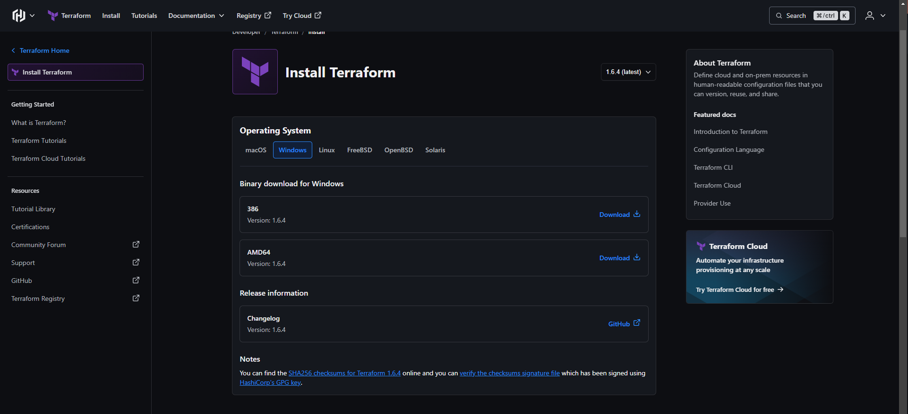

1. Depois de baixar o arquivo compactado, extraia-o e crie um pasta no **_disco C_** chamada **terraform** e vamos colocar o arquivo executável **terraform.exe.** dentro dela.

```
md terraform-aws-example
cd .\terraform-aws-example\
```

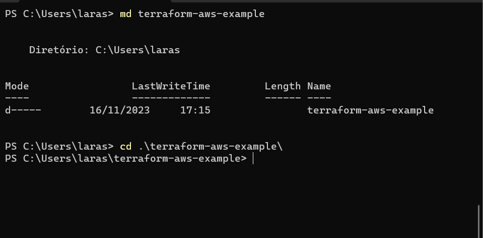

### Configurar o PATH para o Terraform

1. Clique no menu **iniciar** no **Windows**, e pesquise por: **_exibir configurações avançadas do sistema_**

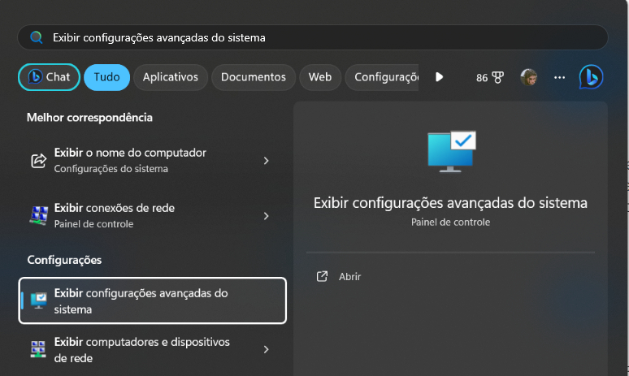

2. Em seguida, A tela **Propriedades do sistema** será exibida, clique em **Variáveis de Ambiente**.

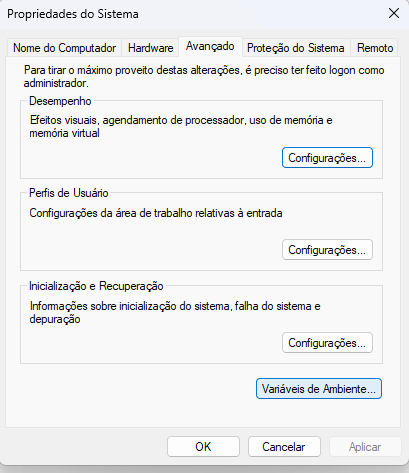

3. Na tela de **variáveis de Ambiente**, clique em **Path –> Editar.**

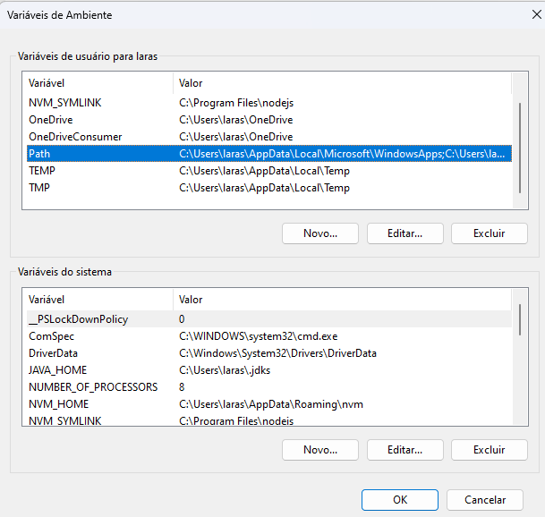

4. Selecione a opção **_Novo_**, insira o caminho **C:\terraform** e depois clicar em **OK**.

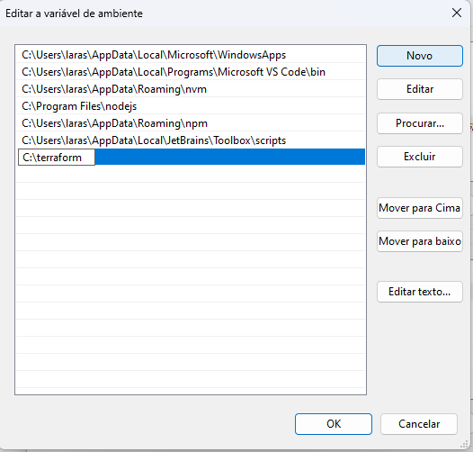

- **Clique em Ok até fechar todas as telas das variáveis de ambiente.**

### Validar se as configurações foram feitas de forma correta

1. Vamos verificar a versão do **Terraform** instalada. Abra o terminal no Windows e digite o comando:

```
terraform -version
```

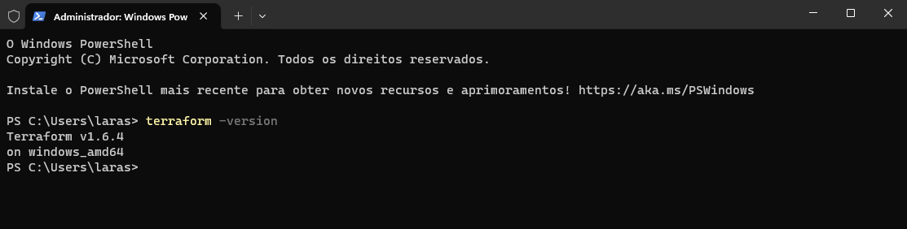

- Em seguida crie o arquivo de configuração do **Terraform**, usando o comando **code main.tf**, para abrir o **VSCode**

- Dentro do arquivo **main.tf** no vscode, adicione a seguinte configuração para criar uma **_instância ec2_** e salve o arquivo.

```
terraform {
  required_providers {
    aws = {
      source  = "hashicorp/aws"
      version = "~> 4.16"
    }
  }

  required_version = ">= 1.2.0"
}

provider "aws" {
  region  = "us-west-2"
}

resource "aws_instance" "compass_terraform" {
  ami           = "ami-830c94e3"
  instance_type = "t2.micro"

  tags = {
    Name = "ExampleInstance"
  }
}
```

#### De volta ao Terminal

- Ao criar uma nova configuração, você precisa inicializar o diretório com **_terraform init_**.

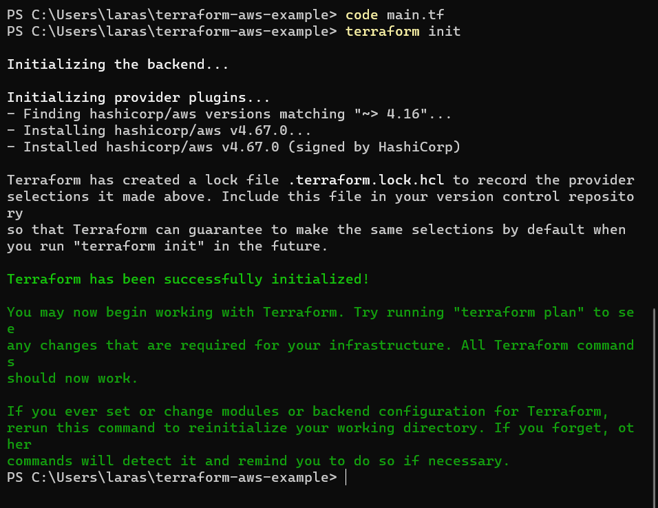

- Aplique a configuração agora com o **_terraform apply_**.

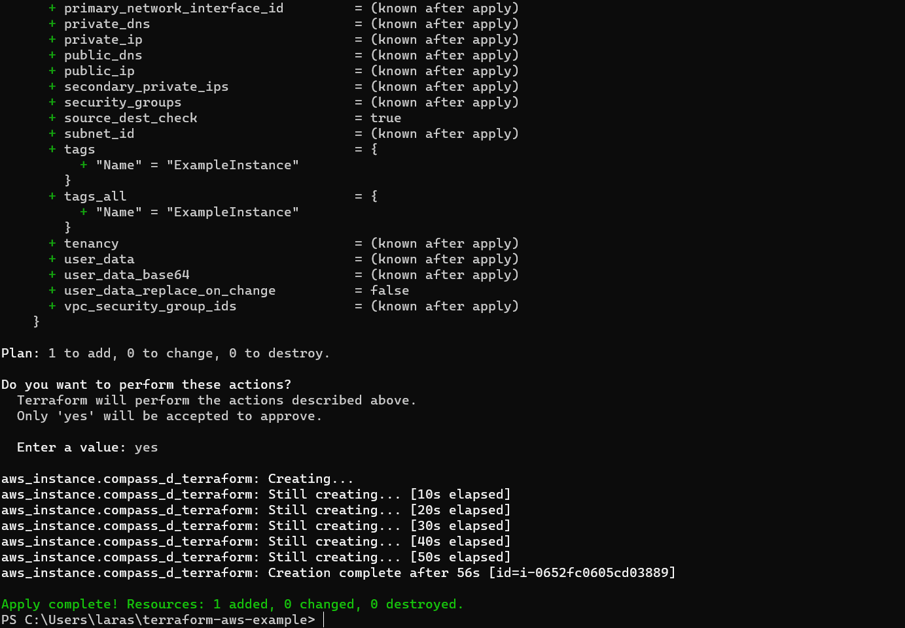

### AGORA NO AWS CONSOLE

1. Verifique o console da AWS para confirmar a criação da instância EC2.

- Em **Serviços** procure por **EC2**, e veja as **Instances** que estão rodando:

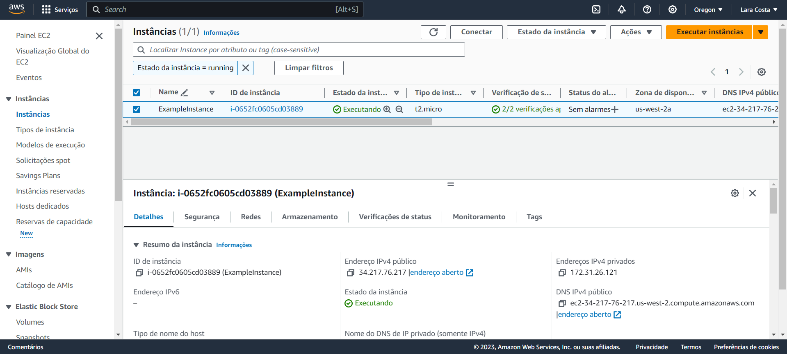

### No terminal

- E depois use o comando **_terraform destroy_** para encerrar a **ec2 instance**

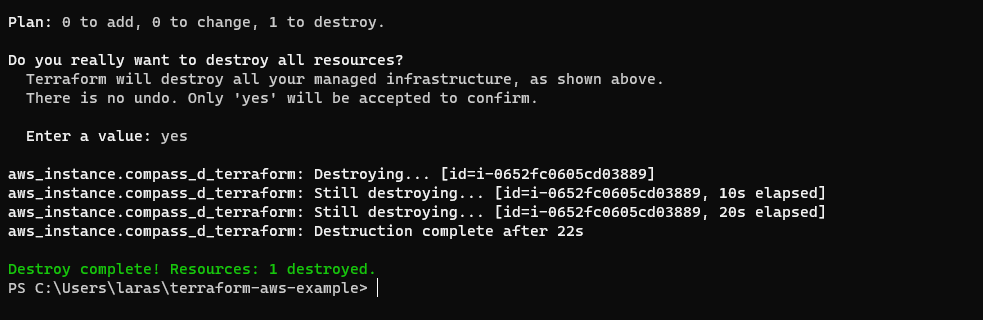

### No Console AWS

- Verifique se a instancia foi encerrada corretamente no console

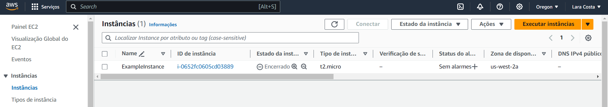
